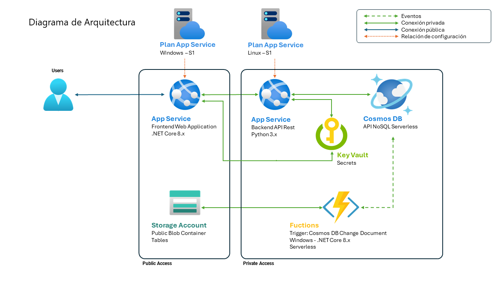

<div align="center">

# :package:STOCKSMART AED

</div>
<div align="center">

### Nuestro Equipo

|                                  |                                        |                                      |
| :-----------------------------------------------------------------------------------------------------: | :---------------------------------------------------------------------------------------------------------: | :------------------------------------------------------------------------------------------------: |
|                                     **Esperanza Salas Gonz 谩 lez**                                     |                                      **Jos 茅 David Prieto Su 谩 rez**                                      |                                      **Aaron Castellano Bao**                                      |
| 馃敆[LinkedIn](https://www.linkedin.com/in/esperanzasalasgon/) / 馃悪[GitHub](https://github.com/ESG96) | 馃敆[LinkedIn](https://www.linkedin.com/in/jdavidprietosuarez/) / 馃悪[GitHub](https://github.com/IkonikJD) | 馃敆[LinkedIn](https://www.linkedin.com/in/aaron-cb/) / 馃悪[GitHub](https://github.com/AaronCas7) |

</div>

## Descripci 贸 n de la soluci 贸 n

**StockSmart AED** es una soluci 贸 n integral dise 帽 ada para gestionar las existencias de productos de compa 帽铆 as que comercializan a trav 茅 s de Internet.

Nuestra plataforma utiliza tecnolog 铆 a de Azure con una interfaz intuitiva para optimizar la gesti 贸 n de inventarios, garantizando eficiencia, precisi 贸 n y rentabilidad para su negocio.

## Diagrama de la Arquitectura



## Proyectos

### StockSmart AED

#### **Proyecto:** Aplicaci 贸 n Web MVC

#### **Lenguaje/Framework:** C# .NET Core 8.x

El controlador **Productos** permite:

- Buscar productos por referencia, descripci 贸 n y rango de precios
- Insertar nuevos productos
- Modificar productos existentes
- Eliminar productos

La operativa del controlador se realiza a trav 茅 s del API desarrollada en el proyecto _StockSmartAPI_. Para conectar con el API requiere un **API Key** que se envia como cabecera y se encuantra almacenado en _Azure Key Vault_. El _App Service_ lee autom 谩 ticamente la **API Key** del _Key Vault_ mediante la configuraci 贸 n de una variable de entorno.

### StockSmart API

#### **Proyecto:** API Rest

#### **Lenguaje/Framework:** Python 3.xx con Flask

El proyecto es un API que trabaja con una base de datos Azure CosmosDB. Para conectar con el Cosmos DB requiere una **cadena de conexi 贸 n** almacenada en _Azure Key Vault_. El _App Service_ lee autom 谩 ticamente la **cadena de conexi 贸 n** del _Key Vault_ mediante la configuraci 贸 n de una variable de entorno.

El acceso al API se realiza mediante un **API Key** enviada como cabecera. Si el **API Key** no es valido o no esta presente se retorna _401 Unauthorized_.

El API admite los siguientes m 茅 todos:

| Request | Status Code Response |
| ------- | -------------------- |
| GET     | 200 OK               |
| POST    | 201 Create           |
| PUT     | 200 OK               |
| DELETE  | 204 OK               |

**Definici 贸 n de producto en JSON**

```javascript
{"ProductID":"","ProductName":"","SupplierID":"","CategoryID":"","QuantityPerUnit":"","UnitPrice":"","UnitsInStock":"","UnitsOnOrder":"","ReorderLevel":"","Discontinued":""}
```

#### GET

- **Endpoint:** https://dominio.com/productos/id/

Retorna el producto coincidente con el **id** del producto o _404 Not Found_ si no existe en la base de datos.

#### POST

- **Endpoint:** https://dominio.com/productos/

Inserta un nuevo producto en la base datos. El cuerpo del mensaje contiene los datos del nuevo producto en JSON. Cualquier error retornara un _400 Bad Request_.

#### PUT

- **Endpoint:** https://dominio.com/productos/id/

Actualiza el producto coincidente con el **id** del producto. El cuerpo del mensaje contiene los datos del producto en JSON. Cualquier error retornara un _400 Bad Request_.

#### DELETE

- **Endpoint:** https://dominio.com/productos/id/

Elimina el producto coincidente con el **id** del producto. Cualquier error retornara un _400 Bad Request_.

### StockSmart Functions

#### **Proyecto:** Azure Function

#### **Lenguaje/Framework:** C# .NET Core 8.x

Registra en una tabla de una _Cuenta de Almacenamiento_ las operaciones de actualizaci 贸 n de datos que suceden en Cosmos DB, considerando este registo el LOG de la aplicaci 贸 n API Rest.

Para conectar con la _Cuenta de Almacenamiento_ requiere una **cadena de conexi 贸 n** almacenada en _Azure Key Vault_. El _Function Service_ lee autom 谩 ticamente la **cadena de conexi 贸 n** del _Key Vault_ mediante la configuraci 贸 n de una variable de entorno.
